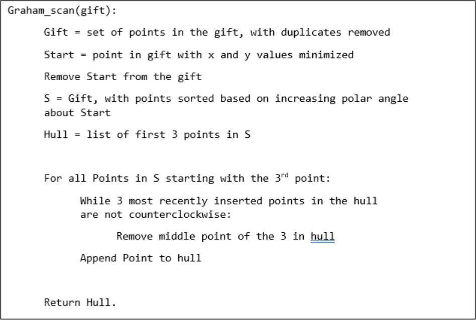
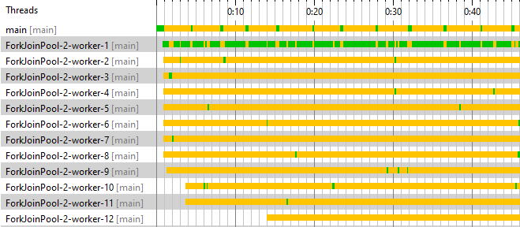

# Framework Fork-Join
Rozwiązywanie problemu w sposób zrównoleglony z wykorzystaniem **ForkJoinPool**

## Wybór problemu
- [ ] Mnożenie macierzy
- [x] Convex Hull Algorithm (Graham Scan)
- [ ] Znajdowanie pary dwóch najbliższych punktów
- [ ] Maximal Subarray Problem (Algorytm Kadane's)

### Źródła
[tutorial 1](https://www.youtube.com/watch?v=B2AJoQSZf4M)

[tutorial 2](https://www.youtube.com/watch?v=ZnTiWcIznEQ)

[medium](https://medium.com/smucs/an-overview-of-the-graham-scan-e6ecc25c30da)

[algorytm archive](https://www.algorithm-archive.org/contents/graham_scan/graham_scan.html)

[merging convex hulls](https://www.youtube.com/watch?v=Q-6Vm_eLsto)

### Algorytm

>  </br>
> źródło: https://medium.com/smucs/an-overview-of-the-graham-scan-e6ecc25c30da</br>

## Określenie progu rozmiaru
```yaml
Problem size: 156823
[Sequential          ] Solving took: 227 ms
[Threshold          4] Solving took: 15 ms
[Threshold          8] Solving took: 9 ms
[Threshold         16] Solving took: 8 ms
[Threshold         32] Solving took: 5 ms
[Threshold         64] Solving took: 5 ms
[Threshold        128] Solving took: 5 ms
[Threshold        256] Solving took: 6 ms
[Threshold        512] Solving took: 6 ms
[Threshold       1024] Solving took: 6 ms
[Threshold       2048] Solving took: 6 ms
[Threshold       4096] Solving took: 8 ms
[Threshold       8192] Solving took: 8 ms
[Threshold      16384] Solving took: 8 ms
[Threshold      32768] Solving took: 8 ms
[Threshold      65536] Solving took: 9 ms
[Threshold     131072] Solving took: 9 ms
[Threshold     262144] Solving took: 11 ms
[Threshold     524288] Solving took: 11 ms
```
## Badanie aplikacji z użyciem profilera

